STAT 540 - Seminar 2b: Introduction to ggplot2
================

-   [Preliminaries](#preliminaries)
-   [Part 1: First time ggplot-ing](#part-1-first-time-ggplot-ing)
-   [Part 2: The layered grammar](#part-2-the-layered-grammar)
-   [Part 3: Example gallery](#part-3-example-gallery)
-   [Part 4: Final notes and additional
    resources](#part-4-final-notes-and-additional-resources)
-   [Part 5: Deliverable](#part-5-deliverable)

# Preliminaries

## Attributions

This seminar was developed by [Eric Chu](https://github.com/echu113)
with seminar materials previously designed by Gloria Li and Alice Zh and
contains excerpts from [R for Data
Science](http://r4ds.had.co.nz/data-visualisation.html) by Garrett
Grolemund and Hadley Wickham. It was later modified by Keegan Korthauer.

## Learning Objectives

By the end of this seminar, you should

-   have an overall understanding of what ggplot2 is and have a sense of
    what is it useful for, and what are its limitations
-   be familiar with ggplot2’s layered grammar - for example, know the
    roles of aes, geom, stat, scale, etc
-   given a dataset, be able to render basic plots such as scatter
    plots, boxplots, density plots, and histograms
-   have practical experience exploring ggplot2 functions by tweaking
    rendered visualizations (mappings, colours, shapes, transformations,
    etc)
-   be able to navigate [the ggplot2
    cheatsheet](https://www.rstudio.com/wp-content/uploads/2015/03/ggplot2-cheatsheet.pdf)
    in order to develop a data visualization

## Packages required

-   [tidyverse](http://tidyverse.tidyverse.org/) (includes
    [ggplot2](http://ggplot2.tidyverse.org/),
    [dplyr](http://dplyr.tidyverse.org/),
    [tidyr](http://tidyr.tidyverse.org/),
    [readr](http://readr.tidyverse.org/),
    [purrr](http://purrr.tidyverse.org/),
    [tibble](http://tibble.tidyverse.org/))
    -   Install by running ‘install.packages(“tidyverse”, dependencies =
        TRUE)’
    -   Note: If loading tidyverse with `library(tidyverse)` gives you
        issues with package and R versions one possible solution would
        be to:
        -   close Rstudio
        -   install the latest version of R from our [CRAN
            mirror](https://mirror.its.sfu.ca/mirror/CRAN/)
        -   Reopen Rstudio and try reinstalling tidyverse as before

## Main functions used

-   **ggplot2::ggplot()** - Base function for using ggplot2. Lays out
    the invisible ‘canvas’ for graphing.
-   **ggplot2::geom_point()** - Geom function for drawing data points in
    scatterplots.
-   **ggplot2::geom_smooth()** - Geom function for drawing fitted lines
    in trend charts.
-   **ggplot2::geom_density()** - Geom function for drawing density
    plots.
-   **ggplot2::geom_boxplot()** - Geom function for drawing box plots.
-   **ggplot2::geom_histogram()** - Geom function for violin plots.
-   **ggplot2::facet_wrap()** - ggplot2 function for separating factor
    levels into multiple graphs.
-   **ggplot2::xlab()** - Manually set x-axis label.
-   **ggplot2::ylab()** - Manually set y-axis label.
-   **ggplot2::scale_y\_log10()** - Reverse y-axis.
-   **ggplot2::coord_flip()** - Flip x and y axes.

# Part 1: First time ggplot-ing

Open a new .Rmd file. This is where we will work on ggplot2.

> “The simple graph has brought more information to the data analyst’s
> mind than any other device.” — John Tukey

This chapter will teach you how to visualise your data using ggplot2. R
has several systems for making graphs, but ggplot2 is one of the most
elegant and most versatile. ggplot2 implements the grammar of graphics,
a coherent system for describing and building graphs. With ggplot2, you
can do more faster by learning one system and applying it in many
places.

First, we load tidyverse, which includes ggplot2. It also includes
several packages which are useful in most any data analysis.

``` r
library(tidyverse)
```

    ## ── Attaching packages ─────────────────────────────────────── tidyverse 1.3.1 ──

    ## ✓ ggplot2 3.3.5     ✓ purrr   0.3.4
    ## ✓ tibble  3.1.6     ✓ dplyr   1.0.7
    ## ✓ tidyr   1.1.4     ✓ stringr 1.4.0
    ## ✓ readr   2.1.1     ✓ forcats 0.5.1

    ## ── Conflicts ────────────────────────────────────────── tidyverse_conflicts() ──
    ## x dplyr::filter() masks stats::filter()
    ## x dplyr::lag()    masks stats::lag()

The output of loading the tidyverse tells you which functions from the
tidyverse conflict with functions in base R (or from other packages you
might have loaded). If you call any of these functions, it’s safest to
call them with their `package::function()` prefix to tell R which
version of the function to use. For example, `ggplot2::ggplot()` tells R
explicitly that we’re using the ggplot() function from the ggplot2
package.

If you run this code and get the error message “there is no package
called ‘tidyverse’”, you’ll need to first install it, then run library()
once again.

``` r
# not run
install.packages("tidyverse", dependencies = TRUE)
library(tidyverse)
```

You only need to install a package once, but you need to reload it every
time you start a new session. See [Packages
required](#packages-required) for some additional help.

## The mpg data frame

Let’s use our first graph to answer a question: Do cars with big engines
use more fuel than cars with small engines? You probably already have an
answer, but try to make your answer precise. What does the relationship
between engine size and fuel efficiency look like? Is it positive?
Negative? Linear? Nonlinear?

You can test your answer with the mpg data frame found in ggplot2 (aka
`ggplot2::mpg`). A data frame is a rectangular collection of variables
(in the columns) and observations (in the rows). `mpg` contains
observations collected by the US Environment Protection Agency on 38
models of car.

Let’s see what the mpg data frame looks like:

``` r
mpg
```

    ## # A tibble: 234 × 11
    ##    manufacturer model      displ  year   cyl trans drv     cty   hwy fl    class
    ##    <chr>        <chr>      <dbl> <int> <int> <chr> <chr> <int> <int> <chr> <chr>
    ##  1 audi         a4           1.8  1999     4 auto… f        18    29 p     comp…
    ##  2 audi         a4           1.8  1999     4 manu… f        21    29 p     comp…
    ##  3 audi         a4           2    2008     4 manu… f        20    31 p     comp…
    ##  4 audi         a4           2    2008     4 auto… f        21    30 p     comp…
    ##  5 audi         a4           2.8  1999     6 auto… f        16    26 p     comp…
    ##  6 audi         a4           2.8  1999     6 manu… f        18    26 p     comp…
    ##  7 audi         a4           3.1  2008     6 auto… f        18    27 p     comp…
    ##  8 audi         a4 quattro   1.8  1999     4 manu… 4        18    26 p     comp…
    ##  9 audi         a4 quattro   1.8  1999     4 auto… 4        16    25 p     comp…
    ## 10 audi         a4 quattro   2    2008     4 manu… 4        20    28 p     comp…
    ## # … with 224 more rows

Among the variables in mpg are:

-   `displ`, a car’s engine size, in litres.

-   `hwy`, a car’s fuel efficiency on the highway, in miles per gallon
    (mpg). A car with a low fuel efficiency consumes more fuel than a
    car with a high fuel efficiency when they travel the same distance.

To learn about the other variables in `mpg`, open its help page by
running `?mpg`.

### Creating a ggplot

To create a plot using these two variables in `mpg`, run this code to
put `displ` on the x-axis and `hwy` on the y-axis:

``` r
ggplot(data = mpg) + 
  geom_point(mapping = aes(x = displ, y = hwy))
```

<!-- -->

The plot shows a negative relationship between engine size (`displ`) and
fuel efficiency (`hwy`). In other words, cars with big engines use more
fuel. Does this confirm or refute your hypothesis about fuel efficiency
and engine size?

With ggplot2, you begin a plot with the function `ggplot()`. `ggplot()`
creates a coordinate system that you can add **layers** to. The first
argument of `ggplot()` is the dataset to use in the graph. So
`ggplot(data = mpg)` creates an empty graph, but it’s not very
interesting so I’m not going to show it here.

You build your graph by adding one or more layers to `ggplot()`. The
function `geom_point()` adds a layer of points to your plot, which
creates a scatterplot. The ggplot2 package comes with many “geom”
functions that each add a different type of layer to a plot. You’ll
learn a whole bunch of them throughout this seminar.

Each geom function in ggplot2 takes a mapping argument. This defines how
variables in your dataset are mapped to visual properties. The mapping
argument is always paired with `aes()`, and the x and y arguments of
`aes()` specify which variables to map to the x and y axes. ggplot2
looks for the mapped variable in the data argument, in this case, `mpg`.

## Your first (bare-bones) graphing template

Let’s turn this code into a reusable template for making graphs with
ggplot2. To make a graph, we can replace the bracketed sections in the
following code template with a dataset, a geom function, and a
collection of mappings. The rest of this seminar will show you how to
complete and extend this template to make different types of graphs.

``` r
# code template
ggplot(data = <DATA>) + 
  <GEOM_FUNCTION>(mapping = aes(<MAPPINGS>))
```

The rest of this seminar will show you how to complete and extend this
template to make different types of graphs. We will begin with the
`<MAPPINGS>` component.

## Exercise

Take 5 minutes to create a scatterplot of `hwy` vs `cyl`.

``` r
# YOUR CODE HERE
```

## Aesthetic mappings

In the plot below, one group of points (highlighted in red) seems to
fall outside of the linear trend. These cars have a higher mileage than
you might expect. How can you explain these cars?

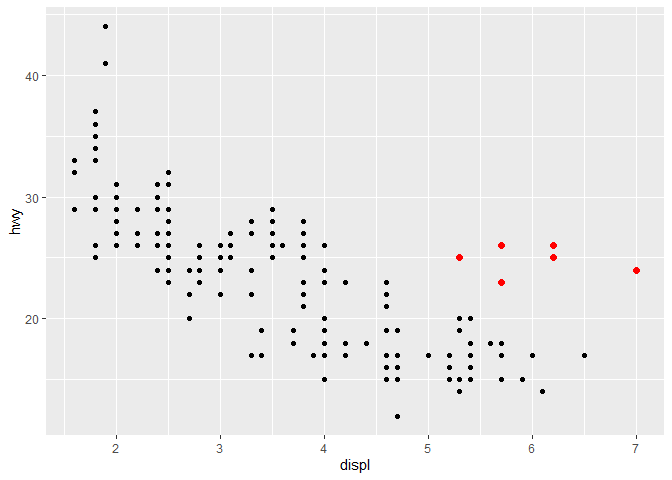<!-- -->

Let’s hypothesize that the cars are hybrids. One way to test this
hypothesis is to look at the `class` value for each car. The `class`
variable of the `mpg` dataset classifies cars into groups such as
compact, midsize, and SUV. If the outlying points are hybrids, they
should be classified as compact cars or, perhaps, subcompact cars (keep
in mind that this data was collected before hybrid trucks and SUVs
became popular).

You can add a third variable, like `class`, to a two dimensional
scatterplot by mapping it to an **aesthetic**. An aesthetic is a visual
property of the objects in your plot. Aesthetics include things like the
size, the shape, or the color of your points. You can display a point
(like the one below) in different ways by changing the values of its
aesthetic properties. Since we already use the word “value” to describe
data, let’s use the word “level” to describe aesthetic properties. Here
we change the levels of a point’s size, shape, and color to make the
point small, triangular, or blue:

<!-- -->

You can convey information about your data by mapping the aesthetics in
your plot to the variables in your dataset. For example, you can map the
colors of your points to the class variable to reveal the class of each
car.

``` r
ggplot(data = mpg) + 
  geom_point(mapping = aes(x = displ, y = hwy, color = class))
```

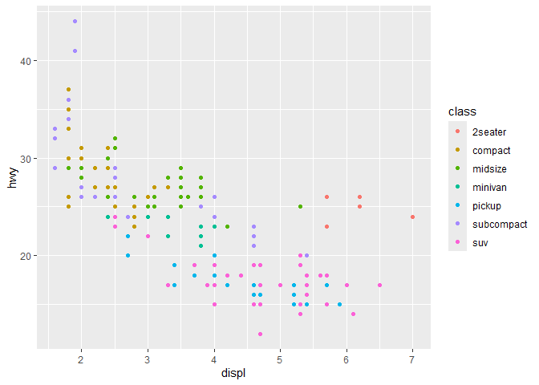<!-- -->

(ggplot2 allows British and American English spellings, e.g. colour or
color.)

To map an aesthetic to a variable, associate the name of the aesthetic
to the name of the variable inside `aes()`. ggplot2 will automatically
assign a unique level of the aesthetic (here a unique color) to each
unique value of the variable, a process known as scaling. ggplot2 will
also add a legend that explains which levels correspond to which values.

The colors reveal that many of the unusual points are two-seater cars.
These cars don’t seem like hybrids, and are, in fact, sports cars!
Sports cars have large engines like SUVs and pickup trucks, but small
bodies like midsize and compact cars, which improves their gas mileage.
In hindsight, these cars were unlikely to be hybrids since they have
large engines.

In the above example, we mapped class to the color aesthetic, but we
could have mapped class to the size aesthetic in the same way. In this
case, the exact size of each point would reveal its class affiliation.
We get a **warning** here, because mapping an unordered variable (class)
to an ordered aesthetic (size) is not a good idea.

``` r
ggplot(data = mpg) + 
  geom_point(mapping = aes(x = displ, y = hwy, size = class))
```

    ## Warning: Using size for a discrete variable is not advised.

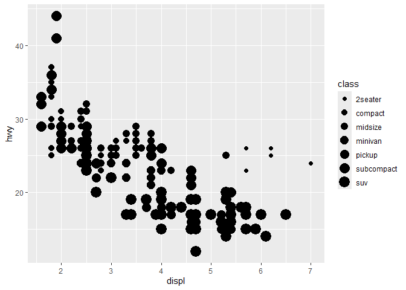<!-- -->

For each aesthetic, you use `aes()` to associate the name of the
aesthetic with a variable to display. The `aes()` function gathers
together each of the aesthetic mappings used by a layer and passes them
to the layer’s mapping argument. The syntax highlights a useful insight
about x and y: the x and y locations of a point are themselves
aesthetics, visual properties that you can map to variables to display
information about the data.

Once you map an aesthetic, ggplot2 takes care of the rest. It selects a
reasonable scale to use with the aesthetic, and it constructs a legend
that explains the mapping between levels and values. For x and y
aesthetics, ggplot2 does not create a legend, but it creates an axis
line with tick marks and a label. The axis line acts as a legend; it
explains the mapping between locations and values.

You can also set the aesthetic properties of your geom manually. For
example, we can make all of the points in our plot blue:

``` r
ggplot(data = mpg) + 
  geom_point(mapping = aes(x = displ, y = hwy), color = "blue")
```

<!-- -->

Here, the color doesn’t convey information about a variable, but only
changes the appearance of the plot. To set an aesthetic manually, set
the aesthetic by name as an argument of your geom function; i.e. it goes
outside of `aes()`.

**IMPORTANT** - Take note of what goes inside or outside of `aes()` and
what the corresponding effects are. Putting colour outside `aes()` and
expecting the colors to map to some variable is a common rookie mistake.

## Exercise:

What has gone wrong with this code? Explain why the points in the
following plot are not blue.

``` r
    ggplot(data = mpg) + 
      geom_point(mapping = aes(x = displ, y = hwy, color = "blue"))
```

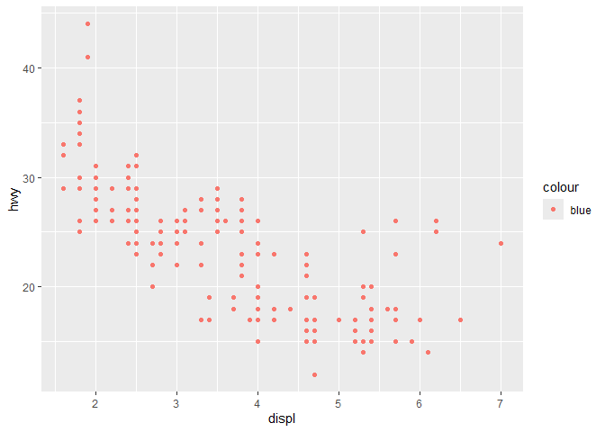<!-- -->

# Part 2: The layered grammar

Now you’ve seen some data visualizations made using ggplot2. Pretty
neat, right?

But at this point, you might be very confused by the syntax, especially
if you have seen some base R or lattice graphing functions. Other
graphing systems often have specific function calls for specific types
of graphs and takes a variety of inputs in order to tweak the
corresponding details.

In contrast, the power of ggplot2 lies in its layered grammar. Notice
that the call to `ggplot2()` by itself doesn’t produce a graph. It
simply lays out a invisible canvas for subsequent “geoms” to be added
to. In this way, new things are “layered” on top of each other to
produce the final visualization.

If you’d like to learn more about the theoretical underpinnings of
ggplot2, read more
[here](http://vita.had.co.nz/papers/layered-grammar.pdf)

## Basic concepts

**Layer**: The most important concept of ggplot2 is that graphics are
built from different layers. This includes anything from the data used,
the coordinate system, the axis labels, the plot’s title etc. This
layered grammar is perhaps the most powerful feature of ggplot2. It
allows one to build complex graphics by adding more and more layers to
the basic graphics while each layer is simple enough to construct.
Layers can contain one or more components such as data and aesthetic
mapping, geometries, statistics, scaling etc. We will talk about some
most common components next.

**Aesthetics**: They are graphic elements mapped to data defined by
`aes()`. Some of the common aesthetics we usually define are: x-y
positions, color, size, shape, linetype etc. Beginners are usually
easily confused between aesthetics and geometries. An easy way to
distinguish is that you are always trying to assign (map) data to some
graphic elements in aesthetics, while in geometries you don’t feed in
any information on the data. It will become clear with some examples
later

**Geometries**: These are the actual graphic elements used to plot, like
points / lines / bars etc. These functions usually start with `geom_`
and their names are usually self-explanatory. You can also specify color
and other graphic elements in these functions, but it will be a single
value that’s applied to the entire data. Refer to [this reference
page](https://ggplot2.tidyverse.org/reference/#section-geoms) for a list
of geoms available.

**Statistics**: These provide a simple and powerful way to summarize
your data and present calculated statistics on the plot, like adding a
regression line, a smoothed curve, calculating density curves etc. For a
full list, see below. You can see some of the functions look very
similar to some geom functions. Indeed these two categories are not
mutually exclusive. Refer to [this reference
page](https://ggplot2.tidyverse.org/reference/#section-stats) for a list
of available `stat` arguments.

**Scale**: Another powerful feature to alter the default scale to x-y
axes, e.g. do a log transformation, instead of the traditional 2-step
approach of transforming the data first and then plot it. You can also
do more advanced customization to features like color, fill, etc. with
these functions. Refer to [this reference
page](https://ggplot2.tidyverse.org/reference/#section-scales) for a
list of scale functions available.

**Additional layers**: Even more options are to add layers

-   [**Coordinate
    systems**](https://ggplot2.tidyverse.org/reference/#section-coordinate-systems):
    define how x and y aesthetics combine to position elements in the
    plot

-   [**Facets**](https://ggplot2.tidyverse.org/reference/#section-facetting):
    create multiple panels, each displaying subsets of the data

-   [**Guides**](https://ggplot2.tidyverse.org/reference/#section-guides-axes-and-legends):
    additional control over axes and legends

### New template with more layers

Let’s expand our horizons with a new template plotting function that
includes more of these layers.

``` r
ggplot(data = <DATA>) + 
  <GEOM_FUNCTION>(
    mapping = aes(<MAPPINGS>),
    stat = <STAT>, 
    position = <POSITION>) +
  <COORDINATE_FUNCTION> +
  <SCALE_FUNCTION> +
  <FACET_FUNCTION> +
  <AXIS_LABEL_FUNCTION>
```

Note that this template doesn’t include every possible use case. But it
does a pretty good job illustrating the structure of a typical ggplot
call. Notice how things are “layered up”?

## How to use this template?

So far, you’ve seen the basic scatterplot with using `geom_point()` and
`aes()` functionalities. Now, we will showcase a sample of the other
functionalities so you have an idea of how to build more elaborate
visualizations with the given template.

## <GEOM_FUNCTION>

We can sub, or add in various geom functions.

### Adding a geom layer

As an example, let’s add a smooth line (regression with loess) using
`geom_smooth()` to our previous scatterplot of engine size against fuel
efficiency.

``` r
ggplot(data = mpg, 
       mapping = aes(x = displ, y = hwy)) +
  geom_point() +
  geom_smooth()
```

    ## `geom_smooth()` using method = 'loess' and formula 'y ~ x'

<!-- -->

Notice that `mapping = aes()` has been moved to the `ggplot()` call.
This ensures that this argument is passed to all subsequent layers:
`geom_point()` and `geom_smooth()` in this case. If you move the `aes()`
argument in both layers separately, the result would be exactly the
same. Try it!

Aside: How should you decide whether to put your `mapping = aes()` call
in `ggplot()` or in each layer? If you have multiple layers, and want
the mappings to be the same for each layer, you can save some repetition
by placing it in `ggplot()`. But, if your plot needs to use different
mappings in some layers than others, you should place these mappings in
each layer separately.

### Other types of geoms

Now let’s see what we can do with `geom_boxplot()`.

Lets use boxplots to examine highway fuel efficiency among the different
vehicle types.

``` r
ggplot(data = mpg, 
       mapping = aes(x = class, y = hwy)) +
  geom_boxplot() 
```

<!-- -->

Here we go! Looks like pickup trucks and SUVs are the worse in terms of
fuel efficiency. Makes sense?

Note that we could have chosen to make a bar chart of the mean or median
highway fuel efficiency in each class, but a boxplot is much more
informative.

There are many more types of geoms, some of which will be explored in
part 3.

## <AXIS_LABEL_FUNCTION>

The axis labels are pretty ugly right now. Let’s put in nicer look
labels.

``` r
ggplot(data = mpg, 
       mapping = aes(x = class, y = hwy)) +
  geom_boxplot() +
  ylab("Highway Fuel Efficiency (miles per gallon)") +
  xlab("Vehicle Type")
```

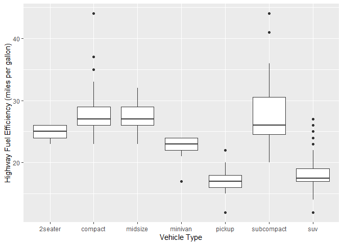<!-- -->

## <SCALE_FUNCTION>

Let’s plot the highway efficiency values on the log scale, just for fun.
Do you notice what has changed?

``` r
ggplot(data = mpg, 
       mapping = aes(x = class, y = hwy)) +
  geom_boxplot() +
  ylab("Highway Fuel Efficiency (miles per gallon)") +
  xlab("Vehicle Type") +
  scale_y_log10()
```

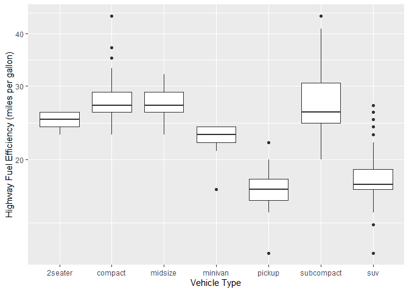<!-- -->

## <COORDINATE_FUNCTION>

Let’s add another “layer” to alter our coordinate system. By default,
`coord_cartesian()` is used for `geom_point()` and `geom_bar()`. But we
could flip the x and y axes, for example.

`coord_flip`?

``` r
ggplot(data = mpg, 
       mapping = aes(x = class, y = hwy)) +
  geom_boxplot() +
  ylab("Highway Fuel Efficiency (miles per gallon)") +
  xlab("Vehicle Type") +
  coord_flip()
```

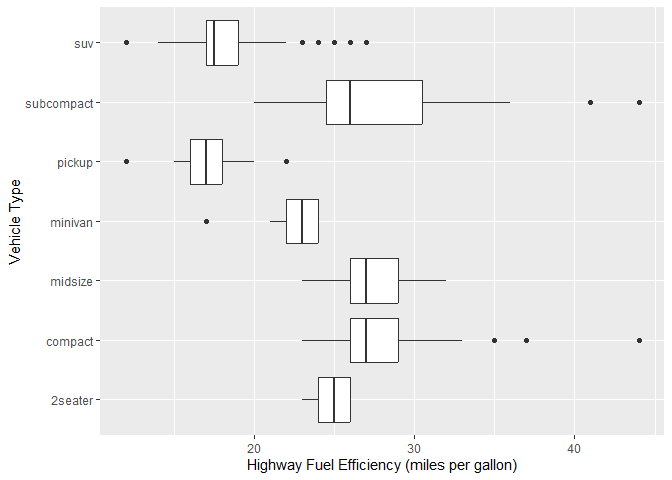<!-- -->

## <FACET_FUNCTION>

A facet allows you to render multiple panels at once, one for each class
of a variable.

To illustrate this functionality, lets go back to our original
scatterplot. Now, you suspect that vehicle type (class) may complicate
this relationship between engine size and fuel efficiency. So let’s use
`facet_wrap()` to split the vehicle types into different plots.

``` r
ggplot(data = mpg, 
       mapping = aes(x = displ, y = hwy)) +
  geom_point() +
  facet_wrap(~class)
```

<!-- -->

There is also the `facet_grid()` function which can create facets based
on more than one variable - read more
[here](http://r4ds.had.co.nz/data-visualisation.html#facets).

# Part 3: Example gallery

We can combine various elements of geoms, aesthetics, facets, etc to
produce a wide variety of plots. We have only scratched the surface.
Here are a few more examples of different types of plots we might want
to make.

### Continuous variable as the third dimension

Lets color the data points by year.

``` r
ggplot(data = mpg, 
       mapping = aes(x = displ, y = hwy, color = year)) +
  geom_point() +
  geom_smooth()
```

    ## `geom_smooth()` using method = 'loess' and formula 'y ~ x'

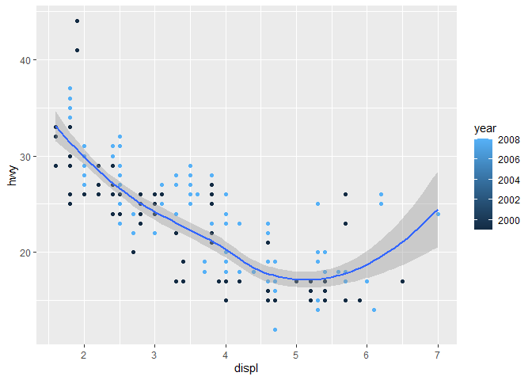<!-- -->

Notice that ggplot makes a color gradient for showing the continuous
variable year. Try a different variable, like `trans`. What happens?

### Combining facets and aesthetics

To illustrate other types of plots we might make, here are several
examples.

A faceted plot with color aesthetics:

``` r
ggplot(data = mpg, aes(x = drv, y = hwy, color = class)) + 
  geom_point() +
  facet_wrap( ~ year) +
  xlab("drivetrain type") +
  ylab("highway map")
```

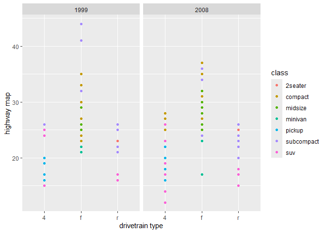<!-- -->

### Histograms

To build a histogram, we use the `geom_histogram()` geom. Here is a
histogram of highway mpg.

``` r
ggplot(data = mpg, aes(x = hwy)) + 
  geom_histogram()
```

    ## `stat_bin()` using `bins = 30`. Pick better value with `binwidth`.

<!-- -->

### Density plots

To build a density plot, we use the `geom_density()` geom. Here is a
smoothed density plot of highway mpg.

``` r
ggplot(data = mpg, aes(x = hwy)) + 
  geom_density()
```

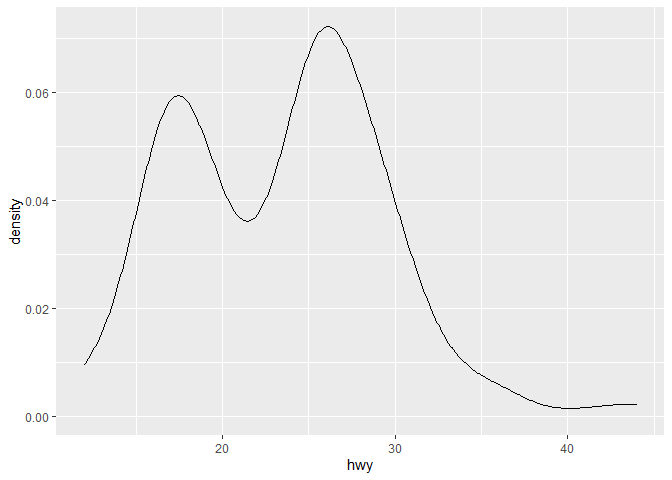<!-- -->

Adding a ‘rug’ of data points at the bottom.

``` r
ggplot(data = mpg, aes(x = hwy)) + 
  geom_density() +
  geom_rug()
```

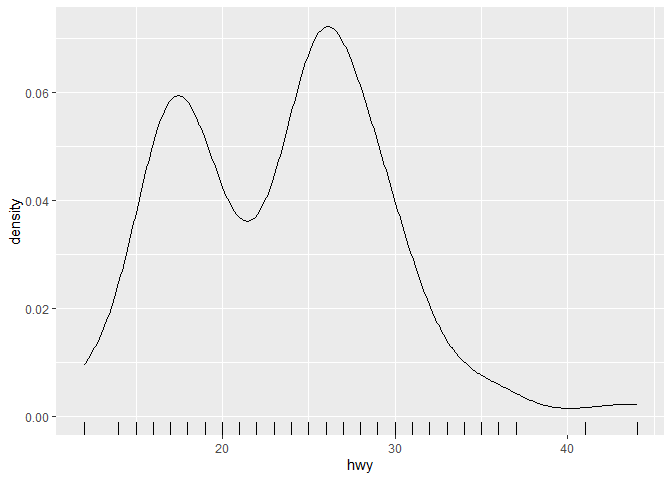<!-- -->

Separate panels for different year of manufacture.

``` r
ggplot(data = mpg, aes(x = hwy)) + 
  geom_density() +
  geom_rug() +
  facet_wrap( ~ year)
```

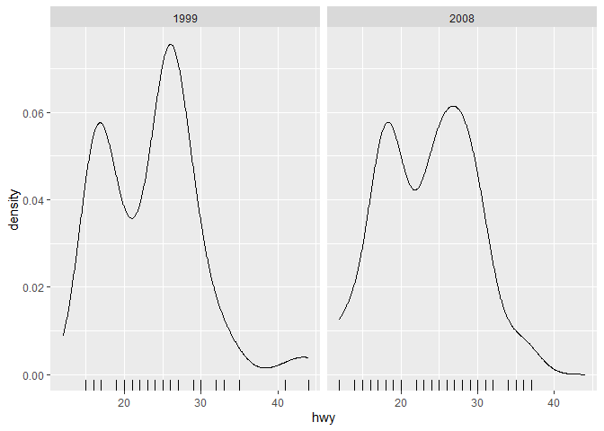<!-- -->

Or color by year.

``` r
ggplot(data = mpg, aes(x = hwy, color = year)) + 
  geom_density() +
  geom_rug()
```

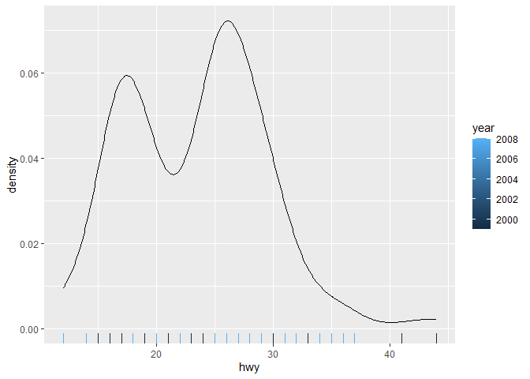<!-- -->

# Part 4: Final notes and additional resources

**We have not covered all possible visualizations**. The purpose of this
seminar was to introduce ggplot2 and to give you the tools to develop
other visualizations that may come your way in the future. Arguably, the
most important takeway of this seminar is the layered grammar of
ggplot2. Once you understand the core structure of the ggplot2 setup, it
will be easy to navigate and use the package’s numerous elements in
order to produce any desired outcome.

Here are a few more resources for your reference:

-   [ggplot2, part of the
    tidyverse](http://ggplot2.tidyverse.org/index.html)
-   [the ggplot2 cheat
    sheet](https://www.rstudio.com/wp-content/uploads/2015/03/ggplot2-cheatsheet.pdf)
-   [The Layered Grammar of
    Graphics](http://vita.had.co.nz/papers/layered-grammar.pdf)
-   [R for Data Science](http://r4ds.had.co.nz/data-visualisation.html)
    by Garrett Grolemund and Hadley Wickham
-   [ggplot2-tutorial by Dr. Jenny
    Bryan](https://github.com/jennybc/ggplot2-tutorial)

# Part 5: Deliverable

**To submit for credit**: To earn full marks for this seminar, do the
following. Reproduce the visual below using the `mpg` dataset by adding
your code below. Then add informative labels to the x and y axes, and
replace the legend titles “drv” and “cyl” with more informative text
(hint: check out the `labs()` function). So your final plot should look
like the image below, but with more informative labels.

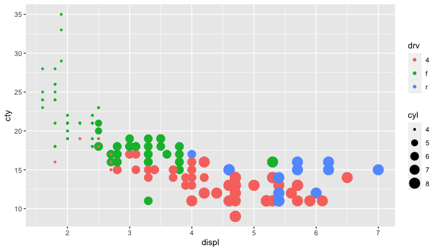

``` r
# YOUR CODE HERE
```
